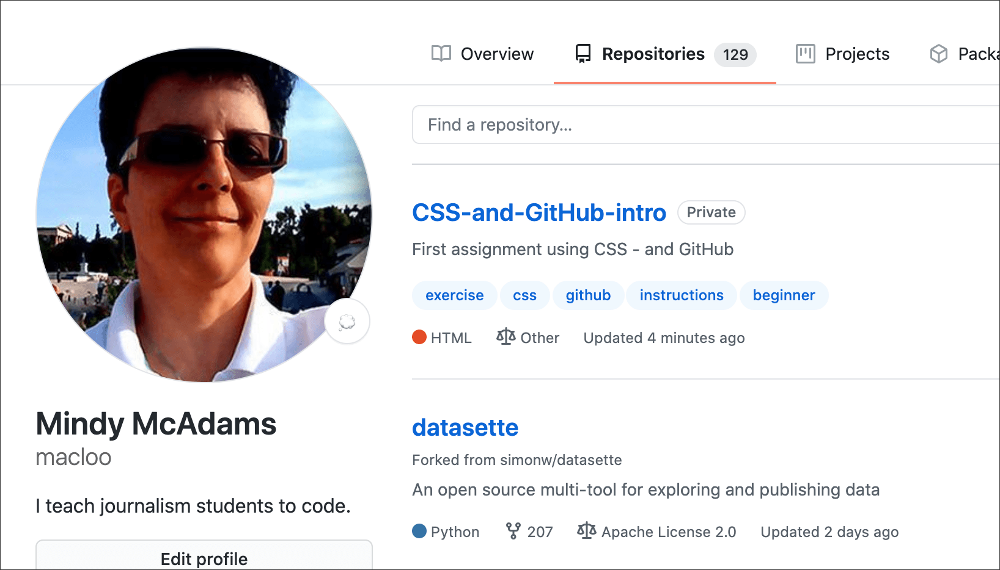

# Start working with CSS

This is a GitHub repo for a first assignment with CSS.

Before you can play, you need to learn some things about GitHub. Do you see the folder above named *github_basics*? Go into that folder, follow all the instructions there, and then come back.

## Forking a repo

You’re back? Good. With your GitHub account and your app all set up, you can now make a copy of this repo for yourself. Make sure you're *signed in.*

A repo can contain lots of files and folders, or few, or none (that would be an empty repo). Each GitHub user can have unlimited repos. As many as you want.

Find the button that says “Fork” (near the top of the page, right side). WAIT BEFORE YOU CLICK IT. This makes **a new, independent copy** of this entire repo under **YOUR GitHub** username. Yes, THIS repo. You will have your own copy. As soon as you click “Fork,” you'll be on YOUR COPY. So scroll to find this text again after that happens.

Click “Fork” now.

After you have your fork (the copy), DO NOT OPEN MINE again.

**Fork:** Your repo (the copy) will not be changed when the original owner changes the original. Likewise, you can change your copy, and it will not affect the original. In most cases, you will only fork ONCE for one repo. (There is a way to update so that yours matches changes made to the original, but let’s leave that aside for now.)

The original URL:

The new URL will contain your username:

**After forking:** The repo does not exist on your computer YET.

Only FORK a repo ONCE. After you have forked it, it exists on your own personal GitHub.com site, on the web.

## Cloning a repo

**NOTE:** Before you CLONE a repo, *make sure* you are on YOUR own personal GitHub.com site.​ DO NOT clone it from my GitHub, where the URL includes “macloo.” Clone it from *your own* GitHub, where the URL includes YOUR NAME.

### Step 1

Find the button that says “**Code**” and click it.

Then click the black text “Open with GitHub Desktop.” Your GitHub Desktop app should already be open.

**IMPORTANT NOTE:** Where it says “https://github.com/macloo/datasette” in my screenshot below &mdash; yours will say “https://github.com/yourname/CSS-and-GitHub-intro” instead. DO NOT CHANGE THIS.

### Step 2

The image below shows ME (macloo) cloning a repo that I forked from another person. Where it says “https://github.com/macloo/datasette” &mdash; yours will say “https://github.com/yourname/CSS-and-GitHub-intro” instead. DO NOT CHANGE THIS.

Where it says “Local Path,” that’s where the repo will be on YOUR COMPUTER. Use the **Choose ...** button to put it exactly where you want it to be. TAKE YOUR TIME with this step and be sure you know where it’s going!

Finally, after that, click the **Clone** button.

### Step 3

In the popup seen below, click “For my own purposes” and then click the **Continue** button.

If you get an error message, double-check that you have followed the steps above correctly.

**Clone** uses your app (GitHub Desktop) to make a copy of the entire repo **on your hard drive,** and this copy is tethered to the version on the GitHub.com site (as you will see). You *might* clone a repo more than once, in some circumstances. But usually ONCE is enough.

## What you should have now

You have the exact same repo &mdash; all the files &mdash;  BOTH on your GitHub online AND locally on your own computer.

### At GitHub.com

At GitHub.com, when you go to your user page/profile, you’ll see a link to your new repo (click it to view the repo). If you were already on the **Repositories** tab, you’ll need to **reload** the page to see the new repo.

### On your own computer

On your hard drive, you’ll see a folder with the *same name* as that GitHub repo. *Do not change the name!* (These two are tethered together, thanks to Git.) Where is that folder? It is where you told it to be saved, when you cloned it.

If you move it to another folder, or rename the folder, your GitHub Desktop app will not be able to find it.

* You have a user page at GitHub. *My* user page is: https://github.com/macloo Yours will be similar, but with your username instead of *macloo*.
* The name of the repo you forked and cloned is: CSS-and-GitHub-intro
* That is both the name of your new repo AND the folder name on your hard drive.
* **DO NOT change the folder name!**
* In the app, you will see all repos listed by name. Probably you only have one repo, so far. To see inside any local repo, click its name in the app.

**You cannot edit files in the GitHub Desktop app.** You will use Atom as usual.

## Next steps

To continue with your assignment, go into the folder above named *git_branches* and follow the instructions there.
