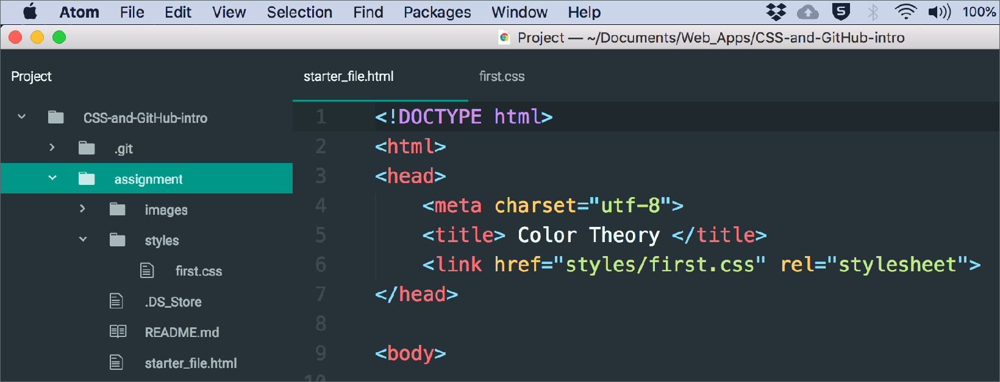
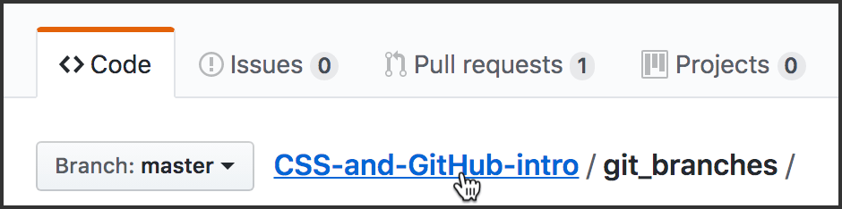

# Instructions for Assignment 3

Make sure you are in the *assignment-yourname* branch in your GitHub app.

If you don't understand that, you probably skipped a step. Not good. Go back and find out where you went off the track.

Up to now, you have done the following:

1. [Created a GitHub account and signed in. Downloaded and installed the GitHub Desktop app.](../github_basics)
2. [Forked and cloned a repo.](../README.md)
3. [Created a new branch and switched to that branch.](../git_branches)

## Save As: Two new files

CHECK THE APP. MAKE SURE YOUR “Current Branch” is your *assignment-yourname* branch.


In Atom: In the *assignment* folder of the repo, you will open two files, *starter_file.html* and *first.css* (inside the *styles* folder).



Open those two files **in your text editor, Atom.**

* *starter_file.html*: Do a Save As and name it with your last name (my file would be *mcadams.html*). Make sure you save this new file into the same place (in the *assignment* folder).

* *first.css* Do a Save As and name it with your last name (my file would be *mcadams.css*). Make sure you save that file inside the *styles* folder (which is inside the *assignment* folder).

* CLOSE *starter_file.html* and *first.css* &mdash; you will not change those.

Please be very careful to follow those instructions exactly.

## Your HTML file

Imagine this file is part of a larger website called “Everything You Need to Know About Web Design.” That would be the name of the *entire site.*

The “Color Theory” article is just one of *many* articles on the site. That's the main heading of the *article* on this page: “Color Theory.”

You will make **ONLY these changes** in the HTML file:

1. Change the `link` tag (in the `head`) to use your own renamed CSS file.
2. Add `article` tags *where they make sense.* Save and reload to see changes. Note that there is only ONE article on this page.
3. Add `header` tags where they make sense. (Think of the entire site as it was described above. What is the logic of the `header` element? It is not HEAD and it is not `h1`; the `header` element has a particular use.)
4. Add `footer` tags where they make sense.
5. Wrap the “Complementary Colors” heading and the two paragraphs below it in a single pair of `aside` tags (in other words: create one `aside` element that contains that heading and the two paragraphs).
6. At the bottom of the page, change the words YOUR NAME HERE to your real first and last name, with normal capitalization (not all uppercase).

All of those tags are covered in your textbook and also in [this
video on YouTube](https://www.youtube.com/watch?v=5ROw8pNE0qc). The video will be very helpful. If you misuse the tags, it will affect your grade.

Do not make any other changes to the HTML — only those six.

## Your color palette

Create a color palette using the [Adobe Color](https://color.adobe.com/) site or another tool. [This video](https://www.youtube.com/watch?v=Um7TVYF0QIU) shows how to use Adobe Color.

**ALL colors in your stylesheet MUST use hexadecimal codes** (explained in chapter 13 and [this video](https://www.youtube.com/watch?v=iJcIlC4yFIQ)).

Your color palette must include four (4) colors that are not white, black or gray. Stay away from overly bright, saturated, or garish colors. Choose colors that look good side-by-side. They can be shades or hues of one another.

## Your CSS file

Note that we have not yet covered fonts, margin, padding, and many other elements of CSS. Do not use what we have not covered. Keep your focus on the purposes of this assignment:

* Write an external CSS stylesheet.
* Keep in mind how **inheritance** and **the cascade** work.
* Use selectors correctly in writing CSS rules.
* Learn to use color in CSS declarations.
* Test and modify your style rules.

We also have not covered use of classes and IDs, so you will apply styles only to *element type selectors* such as `body`, `figure` and `article`.

The [video](https://www.youtube.com/watch?v=W5W4FATwuVk) for chapter 11 demonstrates how to start using CSS.

**ALL styles must be in your external stylesheet file. NO styles can appear in the HTML file.**

### Backgrounds

You must have four colors in your palette (you choose which is color 1, 2, etc.). Style the following:

* Color 1: The background color of both `header` and `footer`. Same color for both.
* Color 2: The background color of `article`.
* Color 3: The background color of both `aside` and `body`. Same color for both.
* Color 4: The background color of `figure`.

After you save and reload in the browser, you might decide your palette needs some changes &mdash; especially if the colors hurt your eyes! Feel free to change your four colors as you save and view the results in your browser. But do use *exactly four different colors* as listed above.

In other words, you can change your palette &mdash; but you must use ONLY and EXACTLY four (4) colors for the four purposes listed above.

Note that the `body` and `article` selectors are already in the stylesheet. Edit or add to the existing declarations. **Do not add another `body` or `article` rule!** (Not sure what a *rule* is? Or a *declaration*? They are explained in chapter 11.)

### Text

When you are satisfied with those results, move on to the text color that is specified in `body`. For this assignment, use only `#fff` (white) or `#000` (black) for text color in `body`. Choose the one that is most readable onscreen, with good contrast.

After you specify the text color for `body`, reload the page and look at each part of the page. Is there any element in which the **contrast** is poor for text on background? If so, you must CHANGE the text color for that element to eliminate poor contrast.

**Poor contrast** means the text is too dark on a dark background, or too light on a light background. You can [test your text and background colors here](https://webaim.org/resources/contrastchecker/) if you’re not sure whether the contrast is acceptable.


### Pseudo classes

The link pseudo-class selectors (`a` elements) are covered in chapter 13.

Note that there are five (5) link pseudo classes, and there is a *required order* for putting them in your stylesheet.

Select colors for all five link pseudo classes that provide **good contrast** with the background color you have given to `figure` — most of the links on this page are in a `figure` element. Save, reload, and adjust as needed to get good contrast.

**ALL colors in your stylesheet MUST use hexadecimal codes** (explained in chapter 13 and [this video](https://www.youtube.com/watch?v=iJcIlC4yFIQ)).

Now look at your `footer`. Chances are the pseudo-class colors that worked everywhere else are not providing a good color experience in your `footer`.

To fix that:

1. Copy the block of all five of your pseudo-class rules.
2. Paste that block below the five rules.
3. For each pseudo-class selector in the second set of five, add the word *footer* at the start.
4. Find and test five new colors for the `footer` pseudo classes.

Original:

```
a:link { color: #3371ac; }
```

Footer version:

```
footer a:link { color: #c363b2; }
```

**ATTENTION!** You do not need to make special footer pseudo classes if the first set of pseudo classes looks fine in the footer. Some students might need to make special pseudo classes for another element, depending on their background color choices. It's all about the contrast!

Save and reload often to test, test, test. If anything looks messed up, it is probably because of a typing error. Check your file carefully.

**You might not need** to change every one of the pseudo classes in the footer, and you might not need to change any of them. Check the contrast for each of the five colors, and use your best judgment.

## Tips

Don't worry about the edges of elements. The text and images are too close to the edges, and this looks ugly. Just live with it. You will learn how to fix this, using borders, margin and padding, soon enough!

Remember, **the focus of this assignment** is using CSS to apply color to specific elements. Mark up the HTML elements correctly and write the CSS for text and background colors correctly.

## Adjusting colors for pseudo classes

You must use five different colors for the five pseudo classes for this assignment. You may ADD colors that are not in your palette (colors 1 through 4), but keep any added colors in the same color range.

In [my video about styling the pseudo classes](https://www.youtube.com/watch?v=otVUAinxGKk), I used this palette for the five pseudo classes on a white background. It gives you an example of how the five colors for pseudo classes might all be similar.


You might find it easiest to start with one suitable link color, and then use [Google’s color picker](https://www.google.com/search?q=color+picker) to collect four shades or hues of that color for the other pseudo classes.

Make sure the **contrast** is good for EACH ONE of the five pseudo classes. You can [test your text and background colors here](https://webaim.org/resources/contrastchecker/) if you’re not sure whether the contrast is acceptable.

## Next steps

When you have tested everything and are satisfied with your HTML and CSS, save and close the two files in your text editor.

**Don't forget to check the rubric!** It is in this repo!

Then go back to the top of this repo, where all files and folders are listed. Go into the folder named *git_commit_and_sync* and follow the instructions there.

*(References to chapters 11 and 13 and “your textbook” mean [this book](http://learningwebdesign.com/).)*



Here’s how to go back to the top of this repo. Click the link for the repo’s name. The link is at the top of this page.

**Note:** It says *master* because it’s the website, GitHub.com. Your branch is only on your desktop right now.
